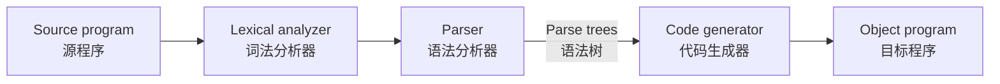
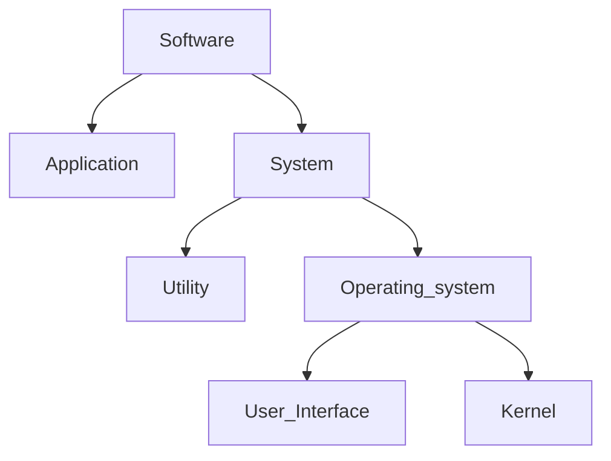

# 2024-2025 计算机科学导论复习要点

## 题型
1. **选择题**：10题共20分
   - (20 points) Write your choices (only one is right for each question).

2. **填空题**：10空共20分
   - (20 points) Fill in the blanks.

3. **简答题**：8题共40分
   - (40 points) Short Answer Questions.

4. **设计与分析题**：2题共20分
   - (20 points) Design and Analysis.

---

## 复习要点
### 1. 缩写的全称及关系
- KB：Kilobyte (千字节)
- MB：Megabyte (兆字节)
- GB：Gigabyte (吉字节)
- TB：Terabyte (太字节)
- PB：Petabyte (拍字节)
### 2. 二进制
- **二进制数的表示**
  - Divide by two and take the remainder:(除二取余法)
  - Floating-point Notation: (浮点计数法)
 - Consists of a sign bit | an exponent field | a mantissa field
            符号位            |     指数域               |         尾数域  
   - Normalized form (规范化形式): fill the mantissa starting with the left-most 1
   - Truncation errors (截断误差): occur when part of the value being stored is lost because the mantissa is not large enough
- **布尔运算(Boolean Operations)**
  - ![[Pasted image 20250108130712.png]]
- **Flip-flops (触发器)**
  - A circuit built from gates that can store one bit.
- **奇偶校验**
  - **奇校验**：每个数据字包含奇数个1。
  - **偶校验**：每个数据字包含偶数个1。
### 3. 表示有符号数的方法
- ##### 原码（True Form）
  - 使用除二取余法计算
  - 只能表示正数
- ##### 补码（Two's Complement）
  - 正数的**补码**与其原码相同
  - 负数的补码是其正数部分的二进制取反，最后加1 (快速方法)
  - Copy the bits from right to left until a 1 has been copied
  - Complement the remaining bits（ppt方法）
- ##### 余码（Excess - K）
  - K是偏移量(通常是$2^{n-1}$)，余码也叫偏移码
  - 余码是其补码的二进制加K
- 四位补码表示：`0110`（正数6），`1101`（负数-3）
- 四位余码表示：`1110`（正数6），`0101`（负数-3）<-  (K=8)
### 4. 进制互转换
- 二进制、八进制、十进制和十六进制的互相转换 
  **10->n**：转换小数部分为n进制：使用乘以n取整法
### 5. 数据压缩(Data Compression)
• Lossy (有损的)  lossless (无损的) 
• Run-length encoding (行程长度编码) 
• Frequency-dependent encoding (频率相关编码) 
	(Huffman codes，哈夫曼编码) 
• Relative encoding (相对编码) 
• Dictionary encoding (字典编码) 
	Includes adaptive dictionary encoding such as LZW encoding
### 6. 数据结构
- 绘制有序二叉树（Binary Search Tree）
- 基于线性探测法的散列表（Hash Table）
- Array (数组)  – Homogeneous array (同构数组) 
- Aggregates (聚合) – Heterogeneous array (异构数组)
- List (表) – Stack (堆栈) – Queue (队列)
- LIFO: Last-in-first-out (后进先出)<-邻接表
- FIFO: First-in-first-out (先进先出)<-循环队列
- Tree (树)
### 7. 算法
- Natural language  flowchart pseudocode source code
- An algorithm is an ordered set of unambiguous, executable steps that defines a terminating process.
- ##### Recursion (递归)
  - The execution of a procedure leads to another execution of the procedure.
  - Multiple activations of the procedure are formed, all but one of which are waiting for other activations to complete.
---
- Polya’s Problem Solving Steps
 1. Understand the problem. 
 2. Devise a plan for solving the problem. 
 3. Carry out the plan. 
 4. Evaluate the solution for accuracy and its potential as a tool for solving other problems.
- Polya’s steps in the context of program development
1. Understand the problem. 
2. Get an idea of how an algorithmic function might solve the problem. 
3. Formulate the algorithm and represent it as a program. 
4. Evaluate the solution for accuracy and its potential as a tool for solving other problems.

### 8. 时间复杂度
- 各种查找的时间复杂度，如线性查找 `O(n)` 、二分查找 `O(logn)` 等
``` c
#include <stdio.h>
int binarySearch(int arr[], int n, int target)
{
	int left = 0;
	int right = n - 1;
	while (left <= right) 
	{
		int mid = left + (right - left) / 2; // 计算中间元素的索引，防止溢出
		if (arr[mid] == target)
			return mid;  // 找到目标元素，返回其索引
		else if (arr[mid] < target)
			left = mid + 1;  // 目标元素在右半部分
		else 
			right = mid - 1;  // 目标元素在左半部分
	}
	return -1;  // 未找到目标元素，返回 -1
}
int main()
{
	int arr[] = {2, 4, 6, 8, 10, 12, 14, 16, 18, 20};//已排序的数组
	int n = sizeof(arr) / sizeof(arr[0]);  //计算数组元素的个数
	int target = 12;  // 要查找的目标元素
	int result = binarySearch(arr, n, target);
	if (result == -1)
		printf("元素 %d 未在数组中找到\n", target);
	else
		printf("元素 %d 在数组中的索引是 %d\n", target, result);
	return 0;
}
```


### 9. 计算机组成
 - ##### Central Processing Unit  CPU（中央处理器）
  - **Arithmetic/Logic unit   ALU（算术逻辑单元）**
    - contains the circuitry that performs on data（数据上执行运算）
  - **Control unit (控制单元)**
    - contains the circuitry for coordinating the machine’s activitie（协调机器活动）
  - **Registers (寄存器)**
   - contains data storage cells that are used for temporary storage of information within the CPU（内部信息临时存放）
   - General purpose registers (通用寄存器)
   - Special purpose registers (专用寄存器)
- ##### Bus (总线)
  - Controllers attached to a machine’s bus
- ##### Motherboard（母版）
- **RAM（Random-Access Memory）**->内存
   - Address: A “name” that uniquely identifies one cell in the computer’s main memory (地址：唯一确定计算机内存单元的“名字”) 
- **ROM（Read-Only Memory）**
### 10. 操作系统
- **操作系统定义**
	An operating system is the software that controls the overall operation of a computer. It provides the means by which a user can store and retrieve files, provides the interface by which a user can request the execution of programs, and provides the environment necessary to execute the programs requested.
- **基本功能**
    - Oversee operation of computer(监视计算机操作) 
    - Store and retrieve files(存储和检索文件) 
    - Schedule programs for execution (调度程序执行)
    - Coordinate the execution of programs (协调程序的执行)
- **User Interface (用户界面) /Shell (外壳):**
  - Communicates with users (与用户通信) 
  - Text based 
  - Graphical user interface (GUI) (图像用户界面) 
- **Kernel (内核): **
  - Performing basic required functions (执行要求的基本功能) 
  - File manager (文件管理器) 
  - Device drivers (设备驱动程序) 
  - Memory manager (内存管理器) 
  - Scheduler and dispatcher (调度程序和分派程序)
- **Stored Program Concept (存储程序概念)**
 - encoded as bit patterns  编码为位模式
 - stored in main memory   存放于内存
 - extract, decode, and execute instructions   抽取、解码和执行指令
 - can be altered by changing   过改变内存的内容
### 11.  机器语言(Machine Language)
- **Philosophies**
 - RISC, Reduced Instruction Set Computer (简化指令集计算机)
 - CISC, Complex Instruction Set Computer (复杂指令集计算机)
- **Types**
 - Data Transfer  (数据传送)
	copy data from one location to another
 - Arithmetic/Logic  (算术/逻辑)
	use existing bit patterns to compute a new bit patterns
 - Control  (控制)
    direct the execution of the program
- **Parts of**
 - Op-code (操作码)
	Specifies which operation to execute
 - Operand (操作数)
	Gives more detailed information about the operation
	(Interpretation of operand varies depending on op code)
- **Program Execution**
 - Controlled by two special-purpose registers
   - Program counter: address of next instruction(程序计数器：寄存下一条指令的地址)
   - Instruction register: current instruction(指令寄存器：寄存当前指令)
- **Machine Cycle**
   - Fetch (取指令) - Decode (译码) - Execute (执行)
### 12. 编译与汇编语言(Assembly Langurage)
##### 代码生成可执行文件流程图
Source program -> lexical analyzer-> parser -> code generator ->object program


##### 每一步的执行工具
1. **源代码**：程序员编写的代码（如 `.c` 文件）。
2. **预处理**：由 **预处理器** 执行，处理预处理指令。
3. **编译**：由 **编译器** 执行，将代码转换为汇编语言。
4. **汇编**：由 **汇编器** 执行，将汇编代码转换为目标文件。
5. **链接**：由 **链接器** 执行，将目标文件链接生成可执行文件。
##### 翻译过程


### 13. 高级程序语言
- A programming language is a computer system created to allow humans to precisely express algorithms using a higher level of abstraction.
- Uses high-level primitivesUses(使用高级原语)
##### 面向过程语言 
- The composition of a typical imperative program or program unit (典型的命令型程序或程序单元的构成)
- 第一部分由申明语句组成，描述程序要操作的数据
- 第二部分由命令语句组成，描述程序要执行的动作
##### 面向对象语言
- Object: Active program unit containing both data and procedures (对象是同时包括数据和过程的活动程序单元)
- Class: A template from which objects are constructed (类是构建对象的模版)
- An object is an instance of the class. (对象是类的实例)
	- Instance Variable:（实体变量）
		 Variable within an object (对象中的变量)
	- Method:（方法）
		 Procedure within an object（对象中的过程）
	- Constructor（构造器）
		 Special method used to initialize a new object when it is first constructed（用于对新对象首次构建时进行初始化的特殊方法）

### 14. 软件开发
##### CASE（辅助工具）
- Project planning (项目规划) 
- Project management (项目管理) 
- Documentation (文档编制) 
- Prototyping and simulation (原型开发与仿真) 
- Interface design (界面设计) 
- Programming (程序设计)
##### Methodologies（软件工程方法学）
- Waterfall Model (瀑布模型) 
- Incremental and Iterative Models (增量和迭代模型)
	- Incremental Model vs. Iterative Model
	- Prototyping (原型开发) 
	- Evolutionary (演化式) vs. Throwaway (抛弃式) 
- Open-source Development (开源开发)
- Agile Methodologies (敏捷方法)
	- Extreme Programming (极限编程)
	- Scrum (敏捷开发）
##### Tools of the Trade (行业工具)
- Data Flow Diagram (数据流图)
- Entity-Relationship Diagram (实体关系图)
	- One-to-one relation
	- One-to-many relation
	- Many-to-many relation
- Data Dictionary (数据字典)
- UML, Unified Modeling Language (统一建模语言)
##### 软件生命周期的开发阶段通常包括以下几个主要阶段

| 序号  | 阶段                           | 描述                                   | 输出          |
| --- | ---------------------------- | ------------------------------------ | ----------- |
| 1   | 需求分析<br>Requirement analysis | 收集和分析用户需求，确定软件功能和性能要求。               | 需求规格说明书     |
| 2   | 设计<br>Design                 | 根据需求进行系统设计，包括架构设计、模块设计等。             | 系统设计文档      |
| 3   | 实现<br>Implementation         | 将设计转化为实际代码，进行程序开发。                   | 源代码和可执行文件   |
| 4   | 测试<br>Testing                | 对软件进行各种测试（单元测试、集成测试、系统测试等），确保软件符合需求。 | 测试报告和缺陷修复   |
| 5   | ==部署==                       | 将软件安装到用户环境中，使其可供使用。                  | 已部署的软件和用户手册 |
| 6   | ==维护==                       | 对软件进行持续的支持和维护，修复缺陷、更新功能等。            | 维护日志和更新版本   |
后两项不是传统要求

>这些阶段通常是线性进行的，但在一些现代开发方法（如敏捷开发中，阶段可能是迭代的

- ##### 调试方法
  1. **白盒测试**：
   - **定义**：白盒测试是一种测试方法，测试人员需要了解被测试软件的内部结构和实现。测试者设计测试用例时会基于代码逻辑。
   - **特点**：
     - 关注程序的内部逻辑和流程。
     - 可以进行路径覆盖、语句覆盖等测试。
     - 适用于单元测试和集成测试。
  2. **黑盒测试**：
   - **定义**：黑盒测试是一种测试方法，测试人员不需要了解被测试软件的内部实现，只关注软件的输入和输出。
   - **特点**：
     - 关注功能需求和用户体验。
     - 测试用例基于需求文档、功能规格等。
     - 适用于系统测试和验收测试。
- **设计模块化系统**
     - reduce modules
### 15. 软件类型
- Application software (应用软件)
  - Performs specific tasks for users (productivity, games, software development) (为用户执行特定的任务) 
- System software (系统软件)
  - Provides infrastructure for application software (为应用软件提供基础设施)
  - Consists of operating system and utility software (由操作系统各实用软件构成)



### 16. 网络拓扑
- Scope (按覆盖划分)
	- Personal area network (PAN)(个人域网)(short-range)
	- Local area network (LAN)(局域网) (building/campus)
	- Metropolitan area network (MAN)(城域网) (community)
	- Wide area network (WAN)(广域网)(greater distances) 
- Ownership (按所有权划分) 
	- Closed versus open
- Topology (configuration，按拓扑结构划分)
	- Bus (Ethernet)
	- Star (Wireless networks with central Access Point)
- **应用层（Application Layer）**
- **传输层（Transport Layer)**
- **网络层（Network Layer）**
- **数据链路层（Data Link Layer）**
### 17. 网络协议与概念
- ##### Protocols
  For a network to function reliably, it is important to establish rules by which activities are conducted. Such rules are called protocols.
- ##### IPV4与IPV6
  `1字节 = 8位（bits）`
  
| 特性    | IPv4      | IPv6             |
| ----- | --------- | ---------------- |
| 地址长度  | 32位->`4`  | 128位->`16`       |
| 地址空间  | 大约42亿个地址  | 340万亿亿个地址        |
| 地址表示  | 点分十进制     | 冒号分隔十六进制         |
| 子网划分  | 使用子网掩码    | 使用前缀长度表示         |
| 配置方式  | 手动配置或DHCP | 自动配置（SLAAC）或手动配置 |
| 安全性   | 不内置安全     | 内置IPsec          |
| 广播    | 支持广播      | 不支持广播            |
| 移动性   | 移动性支持有限   | 更好的移动性支持         |
| 头部复杂度 | 头部较简单     | 头部较复杂，包含更多信息     |

- ##### Hypertext Transfer Protocol (HTTP)
	target server that the URL points to
- ##### Domain name
	mnemonic name of host holding the document
- ##### Path
	directory path indicating the location of the document within the host’s file system
- ##### Document name 
### 18. 死锁与信号量
- 死锁的必要条件，信号量与互斥。
- Processes block each other from continuing because each is waiting for a resource that is allocated to another (进程相互阻塞不能继续执行，因为 每个进程都在等待已分配给其他进程的资源) 
- ##### Conditions required for deadlock (发生死锁的必要条件) 
1. Competition for non-sharable resources (**互斥条件**) 
2. Resources requested on a partial basis (**请求和保持条件**) 
3. An allocated resource can not be forcibly retrieved (**不可抢占条件**)
4. Circular wait（**循环等待条件**）

### 19. 数据库模型
- A collection of data that is multidimensional in the sense that internal links between its entries make the information accessible from a variety of perspectives

- 关系数据库模型与面向对象数据库模型
- **Database Management System** (DBMS): A software layer thatmanipulates a database in response to requests from applications
- **Distributed Database**: A database stored on multiple machines – DBMS will mask this organizational detail from its users
- **Data independence**: The ability to change the organization of a database without changing the application software that uses it
### 20. 数据库语法
##### 1. SELECT（选择）
- **含义**：SELECT 是关系数据库中用于从一个或多个表中检索数据的基本操作。它允许用户指定要查询的列以及满足特定条件的行。
##### 2. PROJECT（投影）
- **含义**：PROJECT 操作是从关系中选择某些属性列，而忽略其他列。它主要用于减少结果集中的列数，只返回用户关心的特定属性。
##### 3. JOIN（连接）
- **含义**：JOIN 操作用于将两个或多个关系（表）根据它们之间的关联字段组合在一起，形成一个新的关系。常见的连接类型有内连接（INNER JOIN）、外连接（包括左外连接 LEFT JOIN、右外连接 RIGHT JOIN、全外连接 FULL JOIN）等
### 21. 图灵机
- 图灵机计算过程示例：
  - **状态**：START
  - **当前指针位置**：待定